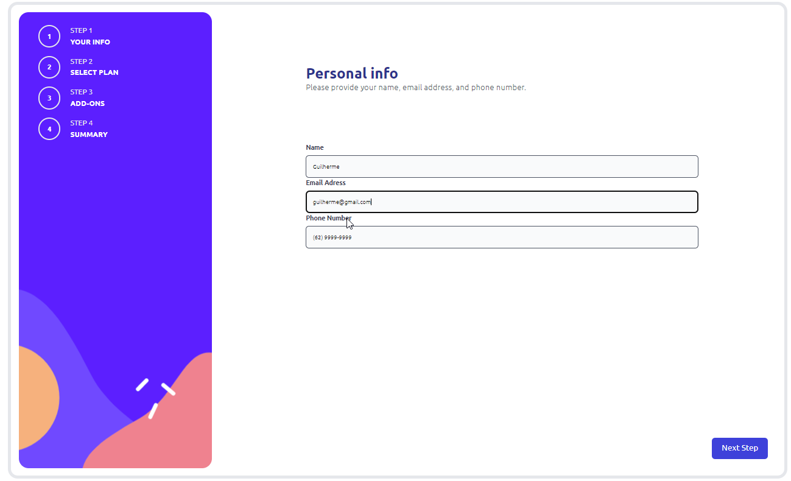
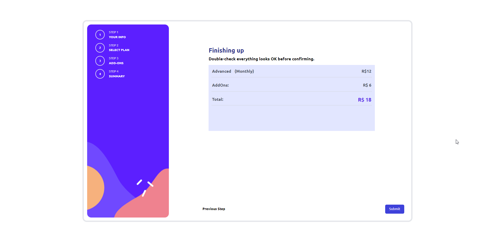
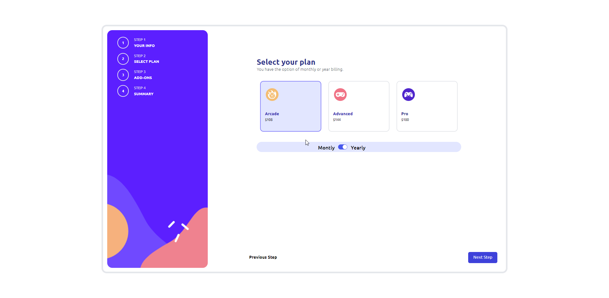
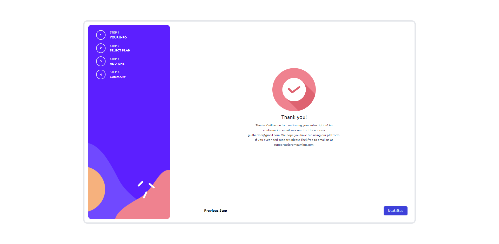
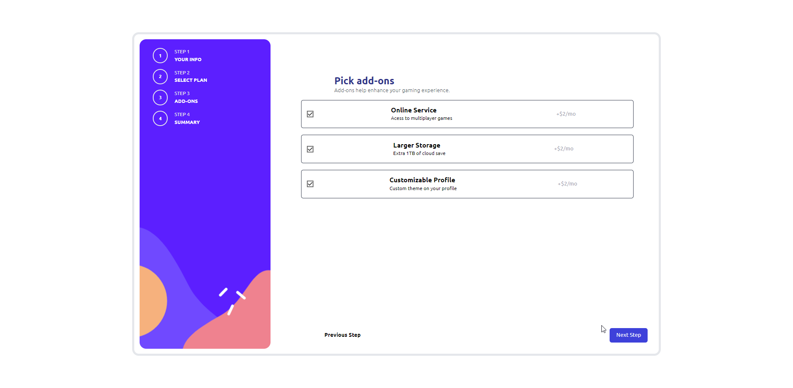

# Frontend Mentor - Formulário de inscrição

## Olá! 👋

[Frontend Mentor](https://www.frontendmentor.io) Desafios com projetos realistas

## Desafio proposto

Criar um formulário dinâmico.
Projeto feito em React, usando ContextApi pra melhorar organização e controle de estado da aplicação

## Design

